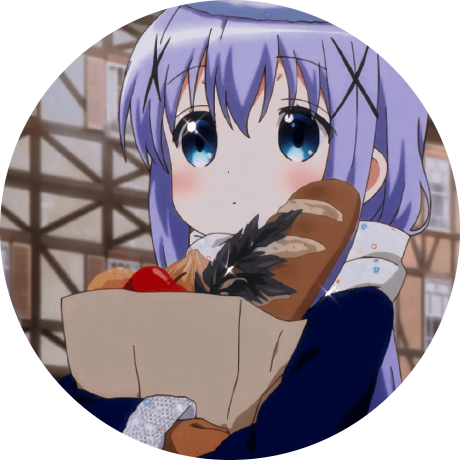
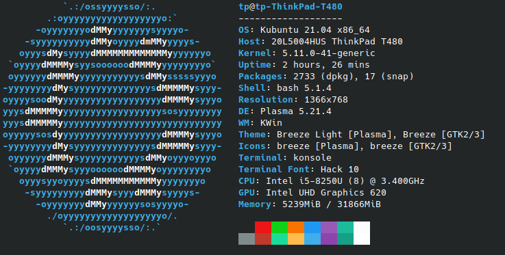
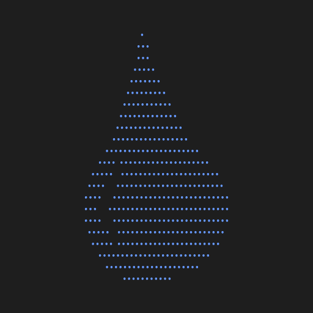

  

<h1 align="center">RainWashed</h1>
<h3 align="center">Student. Developer. Learner</h3>
 

  

## About Me
I am a (progressing) programmer based in Michigan, United States. I enjoy coding both as a passion and a hobby.

## About my Computer
This laptop is the main computer I really code on.\
See ``neofetch`` below.

## My Goal
My main goal in life is find a sense of purpose whether that is with Computer Science or not. I hope to create something big and revolutionary in the future. I am a person who lives in the future a lot, not in the past, or the present.

## Projects
I don't have many projects that are "good" since I lack creativity but here are some that I have public.
- [boredom-blockchain](https://github.com/rainwashed/boredom-blockchain)
- [WindowsTerminalTerminal](https://github.com/rainwashed/windowsterminalterminal)

## My Friends
<ul>
  <li>
    
    <a href='https://github.com/AlmondManttv'>AlmondMan</a>
  </li>
</ul>

## Socials
<ul>
  <li>
    
    <a href='https://github.com/RainWashedROM'>RainWashedROM (alt GitHub)</a>
  </li>
  <li>
    
    <a href='https://github.com/dementia-aswad'>Dementia-Aswad (alt GitHub)</a>
  </li>
  <li>
    
    <a href='https://replit.com/@acli26'>Repl.it Account</a>
  </li>
  <li>
    
    <a href='https://discord.com/users/810960209677516830'>Discord Account</a>  
  </li>   
  <li>
    
    <a href='https://www.instagram.com/rain_washed'>Instagram Account</a>  
  </li>
  <li>
    
    <a href='https://www.youtube.com/channel/UCQhpZRLNpNvw27xslQH9a0g'>YouTube Account</a>  
  </li>
  <li>
    
    <a href='https://rainwashed.org'>My Website</a>
  </li>
</ul>

Last Updated: Dec-5-2021
